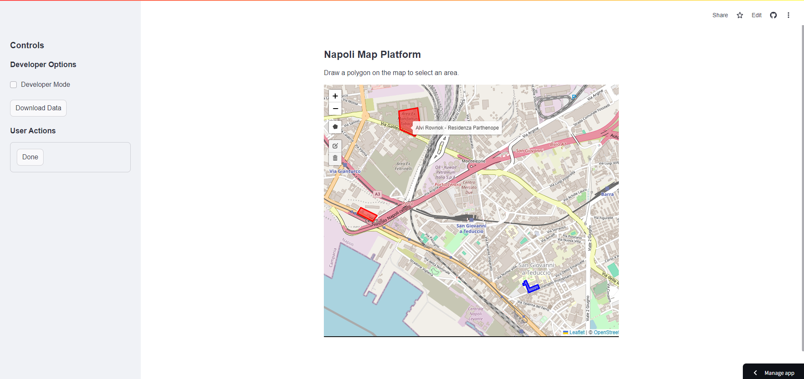

# Napoli GIS Platform



## Table of Contents

- [Overview](#overview)
- [Features](#features)
- [Technology Stack](#technology-stack)
- [Installation](#installation)
  - [Prerequisites](#prerequisites)
  - [Clone the Repository](#clone-the-repository)
  - [Install Dependencies](#install-dependencies)
  - [AWS S3 Configuration](#aws-s3-configuration)
- [Usage](#usage)
  - [Running the App Locally](#running-the-app-locally)
- [Contributing](#contributing)
- [License](#license)
- [Contact](#contact)

## Overview

Napoli GIS Platform is an interactive web application built with Streamlit and Folium that allows users to visualize and manage geographic data for the city of Napoli (Naples). Users can input their personal information, draw polygons on a map to define specific areas of interest, and have this data stored securely in an AWS S3 bucket. The platform ensures each user's polygon is displayed in a unique color for easy differentiation.

**Live Application :** [Napoli_GIS](https://napoli-gis.streamlit.app/)

## Features

- **User Information Input**: Users can enter their personal details including Name (Nome), Surname (Cognome), and Company Name (Nome Impresa).
- **Interactive Map**: Draw polygons on a map of Napoli to select and highlight specific areas.
- **Data Storage**: All polygon data along with user information is stored in a CSV file within an AWS S3 bucket.
- **Unique Polygon Colors**: Each user's polygon is displayed in a unique color for easy differentiation.
- **Responsive Layout**: The map utilizes the full width of the application window, ensuring an optimal user experience.
- **Error Handling**: Robust handling of API errors and AWS S3 interactions to ensure data integrity.

## Technology Stack

- **Frontend**: Streamlit, Folium
- **Backend**: Python
- **Cloud Services**: AWS S3 for data storage
- **APIs**: Overpass API for OpenStreetMap data, Nominatim for geocoding

## Installation

### Prerequisites

- **Python 3.7 or higher**: Ensure you have Python installed. You can download it from [here](https://www.python.org/downloads/).
- **AWS Account**: Necessary for accessing S3 services. Sign up [here](https://aws.amazon.com/).
- **AWS Credentials**: Access key ID and secret access key with permissions to read/write to S3.

### Clone the Repository

```bash
git clone https://github.com/your-username/napoli-gis-platform.git
cd napoli-gis-platform
```

### Install Dependencies

It's recommended to use a virtual environment to manage dependencies.

1. **Create a Virtual Environment**

   ```bash
   python3 -m venv venv
   ```

2. **Activate the Virtual Environment**

   - **On macOS/Linux:**

     ```bash
     source venv/bin/activate
     ```

   - **On Windows:**

     ```bash
     venv\Scripts\activate
     ```

3. **Install Required Packages**

   ```bash
   pip install -r requirements.txt
   ```

   **`requirements.txt`** should include:

   ```plaintext
   streamlit
   folium
   streamlit-folium
   pandas
   boto3
   shapely
   requests
   ```

## Usage

### Running the App Locally

1. **Activate the Virtual Environment** (if not already active)

   ```bash
   source venv/bin/activate  # On macOS/Linux
   # or
   venv\Scripts\activate  # On Windows
   ```

2. **Run the Streamlit App**

   ```bash
   streamlit run app.py
   ```

3. **Interact with the App**

   - Open the provided local URL in your browser.
   - Enter user information, draw polygons, and manage data as needed.

## Contributing

Contributions are welcome! If you'd like to improve the Napoli GIS Platform, please follow these steps:

1. **Fork the Repository**

2. **Create a New Branch**

   ```bash
   git checkout -b feature/YourFeatureName
   ```

3. **Commit Your Changes**

   ```bash
   git commit -m "Add new feature"
   ```

4. **Push to the Branch**

   ```bash
   git push origin feature/YourFeatureName
   ```

5. **Open a Pull Request**

   - Describe your changes and why they are beneficial.

## License

Distributed under the [Apache License 2.0](LICENSE). See `LICENSE` for more information.

## Contact

For any inquiries or support, please contact:

- **Alvi Rownok**
- **Email**: alvi2241998@gmail.com
- **LinkedIn**: [Your LinkedIn](https://www.linkedin.com/in/alvi-rownok/)
- **GitHub**: [your-username](https://github.com/AlviRownok)

---

© 2024 Napoli GIS Platform. All rights reserved.